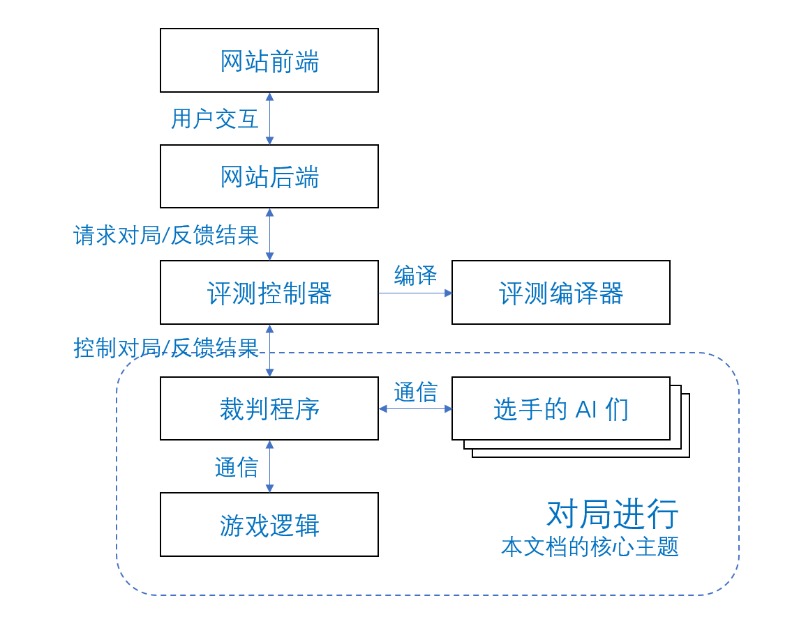

# 智能体大赛引导文档
本文档将详细说明如何使用赛事方提供的sdk或从零开始开发选手个人的ai，并将ai派遣到saiblo平台进行天梯对战。

## saiblo平台的交互逻辑
下图展示了saiblo平台的结构:

在对局过程中，平台向选手AI暴露的只有裁判程序的接口。 裁判程序在比赛进行过程中将通过标准IO接收选手发来的消息，并将其格式化转发给逻辑。 在逻辑进行比赛判定后，如果游戏逻辑希望向选手返回消息，则游戏逻辑将请求裁判程序转发该消息。 裁判程序会将游戏逻辑请求返回的消息格式化后通过标准IO发给选手AI。

在此同时，裁判程序将监控选手AI的运行状态，在选手AI运行状态发生改变或回合运行时间超过设定值时通知游戏逻辑，由游戏逻辑判定进行游戏状态改变或终止游戏。

1. judger 在启动AI后，向游戏逻辑发送AI的初始化信息。如逻辑判定AI行为异常,将报告judger游戏结束。
2. judger 和AI开始交互，交互类型分为以下几种：
      - AI向 judger 发送各种消息，judger需要进行解析与处理；
      - 游戏逻辑请求judger直接将消息转发给AI；
      - judger 将 AI 发送的消息封装后转发给游戏逻辑；
      - judger 将 AI 的异常情况报告给游戏逻辑。
3. 如游戏结束，游戏逻辑向 judger 提供玩家得分，并报告游戏结束。

## 通信协议
由于平台没有限制选手AI与裁判程序的通信格式，通信协议会由游戏开发者规定。 选手需要阅读游戏文档中的通信协议规定，在实现的AI中将操作格式化为通信协议规定的格式。

通常，通信协议包含了AI向judger发送自身操作的格式，以及judger转发的游戏逻辑发送的对方操作、回合结束信息以及可能包含的